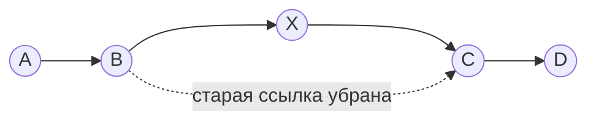

# ArrayList vs LinkedList — какой выбрать и почему

> Классический вопрос на собесе по Java. Большинство помнят «ArrayList на массиве, LinkedList на ссылках» — но плывут на «а что быстрее и почему». Здесь разберём так, чтобы ты ответил уверенно, включая аргумент про cache locality, который отличает junior от middle.

Оба класса реализуют интерфейс `List`: упорядоченный список с доступом по индексу. Снаружи взаимозаменяемы. **Внутри устроены принципиально по-разному** — отсюда вся разница в производительности.

---

## ArrayList — это массив

`ArrayList` хранит элементы в обычном массиве: они лежат в памяти **подряд**, доступ по индексу.

```
индекс:   0     1     2     3     4
        ┌─────┬─────┬─────┬─────┬─────┐
        │  A  │  B  │  C  │  D  │  E  │   ← один непрерывный кусок памяти
        └─────┴─────┴─────┴─────┴─────┘
```

### Суперсила: `get(i)` за O(1)

Массив знает адрес начала. Чтобы достать элемент `i`, он прыгает сразу по адресу `начало + i`. Мгновенно, неважно — 5-й элемент или 500000-й.

### Что при `add()`, когда массив забит

Массив имеет фиксированный размер. Когда он заполнен, а ты добавляешь ещё:

1. Создаётся **новый массив побольше** (примерно ×1.5).
2. Все старые элементы **копируются** в него — это O(n).

Но это случается **не на каждый** `add`. Обычно место есть, и добавление в конец — O(1). Дорогое копирование — лишь изредка. Если усреднить, добавление в конец — **amortized O(1)** (амортизированно дёшево).

### Слабость: вставка/удаление в середину

Элементы лежат подряд по индексам. Чтобы вставить в начало (`add(0, x)`), надо **сдвинуть все остальные** на одну позицию вправо:

```
add(0, X):
        ┌─────┬─────┬─────┬─────┐
        │  A  │  B  │  C  │  D  │
        └─────┴─────┴─────┴─────┘
           └────┴────┴────┴────► всё сдвигается вправо  →  O(n)
        ┌─────┬─────┬─────┬─────┬─────┐
        │  X  │  A  │  B  │  C  │  D  │
        └─────┴─────┴─────┴─────┴─────┘
```

Удаление из середины — то же самое: сдвигать, чтобы закрыть дыру. **O(n).**

---

## LinkedList — это цепочка узлов

`LinkedList` хранит каждый элемент в **узле (node)**. Узел держит значение + **ссылку на следующий** узел (а в Java — ещё и на предыдущий: это **двусвязный** список). Узлы разбросаны по памяти и держатся друг за друга ссылками.

```
[A|prev|next] ⇄ [B|prev|next] ⇄ [C|prev|next] ⇄ null
```

### Сила: вставка/удаление = переподключить ссылки

Чтобы вставить элемент между B и C — не нужно ничего сдвигать. Достаточно переписать ссылки соседей:



Само переподключение — **O(1)**.

### Слабость: `get(i)` за O(n)

У узлов нет индексов-адресов. Чтобы добраться до i-го элемента, надо **идти по цепочке** от начала, считая шаги. 500000-й элемент → 500000 переходов. **O(n).**

---

## Ловушка собеседования: «быстрая вставка» LinkedList — миф

Да, переподключить ссылки — O(1). Но чтобы вставить **в середину**, надо сначала **дойти** до той середины — а это O(n). Значит `add(i, x)` в середину у LinkedList **всё равно O(n)**.

Выигрыш O(1) реален только когда ты **уже стоишь на месте**: на концах списка или когда держишь итератор на нужной позиции.

---

## Итоговая таблица

| Операция | ArrayList | LinkedList |
|---|---|---|
| `get(i)` по индексу | **O(1)** 🟢 | O(n) 🔴 |
| `add()` в конец | amortized O(1) 🟢 | O(1) 🟢 |
| вставка/удаление на концах | O(n) / O(1)* | **O(1)** 🟢 |
| вставка/удаление в середину | O(n) 🔴 | O(n) 🔴 (на поиск позиции) |
| память на элемент | только значение 🟢 | значение + 2 ссылки + объект-узел 🔴 |

\* удаление с конца ArrayList — O(1); с начала — O(n) (сдвиг).

---

## Почему на практике почти всегда ArrayList

**1. Random access O(1)** — берёшь любой элемент по индексу мгновенно.

**2. Cache locality — главный аргумент уровня middle.**
Элементы ArrayList лежат в памяти подряд. Процессор подтягивает непрерывную память в кэш кусками, поэтому проход по ArrayList **летает**. Узлы LinkedList разбросаны по памяти случайно → каждый переход по ссылке = промах кэша → даже простой обход в разы медленнее, хотя оба формально O(n).

**3. Память.** LinkedList тащит на каждый элемент 2 лишние ссылки + объект-узел. ArrayList хранит только значения.

**4. «Быстрая вставка» LinkedList редко применима** — поиск позиции всё равно O(n).

**Вывод:** бери `ArrayList` по умолчанию. `LinkedList` — узкий случай (частые операции с обоими концами, очередь/дек), но и там обычно лучше **`ArrayDeque`**. В реальном проде LinkedList почти не встретишь.

---

## Шпаргалка для собеседования

**«В чём разница ArrayList и LinkedList?»**
ArrayList — на массиве (элементы подряд, доступ по индексу). LinkedList — двусвязный список узлов со ссылками.

**«Что быстрее для get(i)?»**
ArrayList — O(1). LinkedList — O(n) (обход цепочки).

**«А LinkedList же быстрее на вставке?»**
Только переподключение ссылок — O(1), но дойти до позиции в середине — O(n). Реальный выигрыш лишь на концах.

**«Что выберешь по умолчанию и почему?»**
ArrayList: random access, cache locality (непрерывная память → кэш-дружелюбен), меньше памяти.

**«Когда LinkedList?»**
Частые add/remove с обоих концов. Но обычно ArrayDeque лучше.

---

## TL;DR

1. ArrayList = массив: `get(i)` O(1), add-в-конец amortized O(1), вставка в середину O(n).
2. LinkedList = двусвязные узлы: вставка на месте O(1), но `get(i)` O(n).
3. «Быстрая вставка» LinkedList — миф: поиск позиции в середине всё равно O(n).
4. По умолчанию — ArrayList: random access + cache locality + меньше памяти.

## Связанные темы
- hashmap-internals
- equals-and-hashCode
