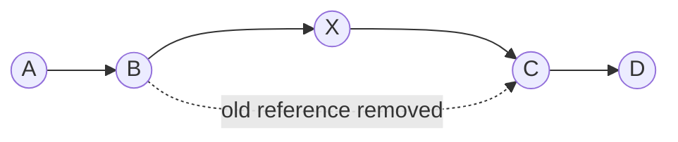

# ArrayList vs LinkedList — which to choose and why

> A classic Java interview question. Most people remember "ArrayList is backed by an array, LinkedList by references" — but flounder on "which is faster and why". Here we'll break it down so you can answer confidently, including the cache-locality argument that separates a junior from a middle.

Both classes implement the `List` interface: an ordered list with index access. From the outside they're interchangeable. **Internally they're fundamentally different** — and that's where all the performance difference comes from.

---

## ArrayList — it's an array

`ArrayList` stores elements in a plain array: they sit in memory **contiguously**, with index access.

```
index:    0     1     2     3     4
        ┌─────┬─────┬─────┬─────┬─────┐
        │  A  │  B  │  C  │  D  │  E  │   ← one contiguous chunk of memory
        └─────┴─────┴─────┴─────┴─────┘
```

### Superpower: `get(i)` in O(1)

The array knows the address of its start. To retrieve element `i`, it jumps straight to the address `start + i`. Instant, whether it's the 5th element or the 500000th.

### What happens on `add()` when the array is full

An array has a fixed size. When it's full and you add another element:

1. A **new, bigger array** is created (roughly ×1.5).
2. All old elements are **copied** into it — that's O(n).

But this happens **not on every** `add`. Usually there's room, and appending to the end is O(1). The expensive copy is only occasional. Averaged out, appending to the end is **amortized O(1)** (amortized cheap).

### Weakness: insert/remove in the middle

Elements sit contiguously by index. To insert at the front (`add(0, x)`), you have to **shift all the others** one position to the right:

```
add(0, X):
        ┌─────┬─────┬─────┬─────┐
        │  A  │  B  │  C  │  D  │
        └─────┴─────┴─────┴─────┘
           └────┴────┴────┴────► everything shifts right  →  O(n)
        ┌─────┬─────┬─────┬─────┬─────┐
        │  X  │  A  │  B  │  C  │  D  │
        └─────┴─────┴─────┴─────┴─────┘
```

Removal from the middle is the same: shift to close the gap. **O(n).**

---

## LinkedList — it's a chain of nodes

`LinkedList` stores each element in a **node**. A node holds a value + a **reference to the next** node (and in Java, also to the previous one: it's a **doubly-linked** list). Nodes are scattered across memory and held together by references.

```
[A|prev|next] ⇄ [B|prev|next] ⇄ [C|prev|next] ⇄ null
```

### Strength: insert/remove = rewire references

To insert an element between B and C — you don't need to shift anything. Just rewrite the neighbors' references:



The rewiring itself is **O(1)**.

### Weakness: `get(i)` in O(n)

Nodes have no index-addresses. To reach the i-th element, you have to **walk the chain** from the start, counting steps. The 500000th element → 500000 hops. **O(n).**

---

## Interview trap: LinkedList's "fast insert" is a myth

Yes, rewiring references is O(1). But to insert **in the middle**, you first have to **reach** that middle — and that's O(n). So `add(i, x)` in the middle of a LinkedList is **still O(n)**.

The O(1) win is real only when you're **already at the spot**: at the ends of the list, or when you hold an iterator at the desired position.

---

## Summary table

| Operation | ArrayList | LinkedList |
|---|---|---|
| `get(i)` by index | **O(1)** 🟢 | O(n) 🔴 |
| `add()` at the end | amortized O(1) 🟢 | O(1) 🟢 |
| insert/remove at the ends | O(n) / O(1)* | **O(1)** 🟢 |
| insert/remove in the middle | O(n) 🔴 | O(n) 🔴 (finding the position) |
| memory per element | value only 🟢 | value + 2 references + node object 🔴 |

\* removal from the end of an ArrayList is O(1); from the front it's O(n) (shift).

---

## Why in practice it's almost always ArrayList

**1. Random access O(1)** — grab any element by index instantly.

**2. Cache locality — the key middle-level argument.**
ArrayList's elements sit in memory contiguously. The CPU pulls contiguous memory into the cache in chunks, so iterating over an ArrayList **flies**. LinkedList's nodes are scattered randomly across memory → every reference hop = a cache miss → even a plain traversal is several times slower, even though both are formally O(n).

**3. Memory.** LinkedList drags along 2 extra references + a node object per element. ArrayList stores only the values.

**4. LinkedList's "fast insert" is rarely applicable** — finding the position is still O(n).

**Conclusion:** reach for `ArrayList` by default. `LinkedList` is a narrow case (frequent operations at both ends, a queue/deque), but even there **`ArrayDeque`** is usually better. In real production you'll almost never see LinkedList.

---

## Interview cheat sheet

**"What's the difference between ArrayList and LinkedList?"**
ArrayList — backed by an array (elements contiguous, index access). LinkedList — a doubly-linked list of nodes with references.

**"Which is faster for get(i)?"**
ArrayList — O(1). LinkedList — O(n) (walking the chain).

**"But isn't LinkedList faster on inserts?"**
Only the rewiring is O(1), but reaching a position in the middle is O(n). The real win is only at the ends.

**"What would you pick by default and why?"**
ArrayList: random access, cache locality (contiguous memory → cache-friendly), less memory.

**"When LinkedList?"**
Frequent add/remove at both ends. But usually ArrayDeque is better.

---

## TL;DR

1. ArrayList = array: `get(i)` O(1), append amortized O(1), insert in the middle O(n).
2. LinkedList = doubly-linked nodes: insert-in-place O(1), but `get(i)` O(n).
3. LinkedList's "fast insert" is a myth: finding the position in the middle is still O(n).
4. By default — ArrayList: random access + cache locality + less memory.

## Related topics
- hashmap-internals
- equals-and-hashCode
