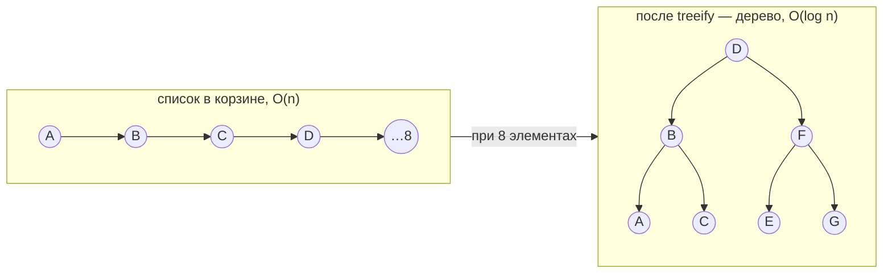

# Как устроен HashMap внутри

> Разбор для тех, кто пользуется `HashMap` каждый день, но не знает, что у него под капотом. После статьи сможешь ответить на любой вопрос про корзины, коллизии, treeify и resize — а это половина собеса по Java Core.

Перед чтением желательно понимать `equals`/`hashCode` → equals-and-hashCode.

---

## Зачем HashMap вообще нужен

`HashMap` хранит пары ключ→значение и умеет находить значение по ключу **почти мгновенно — за O(1)**.

Сравни со списком: чтобы найти элемент в списке из миллиона, надо пройтись по всем — O(n). HashMap так не делает. Вся статья — про то, как именно он добивается O(1) и где этот O(1) ломается.

---

## Корзины (buckets)

Внутри HashMap — массив **корзин**. По умолчанию их **16**.

Когда ты кладёшь пару `put(key, value)`, мапа должна решить, в какую корзину её положить. Решает она по `hashCode` ключа:

```
номер корзины = hashCode(key) % число_корзин
```

(в реальности там битовая операция, но смысл — «разложить hashCode по числу корзин».)

Когда ищешь `get(key)`:

1. Считает `hashCode(key)` → сразу знает корзину. **Мгновенно.**
2. Внутри корзины сравнивает `equals`'ом. **Почти мгновенно.**

Вот откуда берётся O(1).

```
   key "apple"                массив корзин (16 штук)
        │                     ┌──────┐
 hashCode = 93029210          │  0   │
        │                     │  1   │
 93029210 % 16 = 10  ───────► │  10  │──► ["apple" → 5]
                              │ ...  │
                              │  15  │
                              └──────┘
```

---

## Коллизия

Корзин 16, а ключей ты можешь положить тысячи. Рано или поздно два **разных** ключа получат номер **одной и той же** корзины. Это и есть **коллизия** — и она неизбежна.

Что делает HashMap? Он не выбрасывает старый ключ. Он кладёт оба в одну корзину — **списком**:

```
key "cat"  ─ hashCode → корзина 5 ┐
key "dog"  ─ hashCode → корзина 5 ┤
key "fox"  ─ hashCode → корзина 5 ┘
                                  ▼
   Корзина 5:  [cat] → [dog] → [fox]
```

Теперь при `get(ключ B)` мапа находит корзину 5 и идёт по списку, сравнивая `equals`'ом каждый: «это ты? а ты?» — пока не найдёт нужный.

---

## Проблема длинного списка → treeify

Если в одной корзине список из 1000 элементов — поиск по нему снова **O(n)**. Весь смысл HashMap теряется.

Решение: когда список в корзине дорастает до **8 элементов**, Java превращает его в **сбалансированное дерево** (красно-чёрное). Это называется **treeify**.

В дереве поиск — **O(log n)** вместо O(n):

- список из 1000 → до 1000 шагов
- дерево из 1000 → ~10 шагов



**Почему именно 8, а не сразу?** Дерево «дороже» списка — узел занимает больше памяти и требует поддержки баланса. Для маленькой корзины (1–3 элемента) список ищется мгновенно и сам по себе, дерево там только зря ест память. `8` — точка, где выигрыш O(log n) начинает перевешивать накладные расходы.

Важно: при **нормальном** hashCode коллизий из 8+ почти не бывает. treeify — это **страховка** от плохого hashCode, а не штатный режим.

---

## Когда мапа растёт: load factor

По мере добавления элементов корзины заполняются, списки растут, коллизий больше. В какой-то момент HashMap решает **добавить корзин**.

Срабатывает это **не** по отдельной корзине. Мапа смотрит на **общее соотношение**:

```
сколько всего элементов / сколько всего корзин
```

Когда оно достигает **0.75** (это **load factor**, коэффициент загрузки) — мапа увеличивается, обычно **удваивая** число корзин.

На числах: 16 корзин × 0.75 = **12**. Как только положил 12-й элемент → resize до 32 корзин. Мапа не ждёт, пока корзины забьются — реагирует рано, чтобы списки не успевали стать длинными.

**Почему 0.75, а не 1.0 или 0.5?** Это компромисс:

| Load factor | Память | Скорость |
|---|---|---|
| выше (→1.0) | экономим | больше коллизий, медленнее |
| ниже (→0.5) | тратим (пустые корзины, частый resize) | быстрее |
| **0.75** | **золотая середина** | |

---

## Resize и rehashing — почему это дорого

Когда мапа удваивается (16 → 32), возникает тонкий момент.

`hashCode` элемента **не меняется** — он навсегда один. Но **корзина — это не hashCode**, а `hashCode % число_корзин`. Число корзин изменилось → номер корзины изменился.

Пример. Элемент с hashCode = 20:

- при 16 корзинах: 20 % 16 = **корзина 4**
- при 32 корзинах: 20 % 32 = **корзина 20**

hashCode тот же, корзина другая. Значит при resize мапа **обязана пройтись по всем элементам и переразложить их** по новым корзинам. Это **rehashing**.

```
ДО resize (16 корзин)          ПОСЛЕ resize (32 корзины)
┌──────┐                       ┌──────┐
│  4   │──► [hash=20]          │  4   │──► (пусто)
│ ...  │            переезд    │ ...  │
└──────┘            ════════►  │  20  │──► [hash=20]
                               └──────┘
   20 % 16 = 4                    20 % 32 = 20
```

Вывод для собеса:

> resize — **дорогая** операция, **O(n)**: мапа перекладывает все элементы. Если знаешь заранее, что положишь ~1000 элементов — создавай `new HashMap<>(2000)`, чтобы избежать многократных ресайзов.

---

## Шпаргалка для собеседования

**«Как HashMap находит элемент за O(1)?»**
hashCode ключа → номер корзины (мгновенно), внутри корзины equals подтверждает совпадение.

**«Что такое коллизия и как HashMap её обрабатывает?»**
Два разных ключа в одной корзине. Хранятся списком; при 8 элементах список превращается в красно-чёрное дерево (treeify).

**«Почему treeify именно при 8?»**
Дерево дороже списка по памяти; на маленьких корзинах не окупается. 8 — точка окупаемости. Это страховка от плохого hashCode.

**«Что такое load factor?»**
Порог заполнения (0.75). При `элементы/корзины ≥ 0.75` мапа удваивает число корзин. Компромисс между памятью и скоростью.

**«Что происходит при resize?»**
Число корзин удваивается, и все элементы переразлагаются (rehashing), т.к. корзина = hashCode % число_корзин. Операция O(n), дорогая.

**«Как избежать частых resize?»**
Задать начальную ёмкость при создании, если объём известен заранее.

**«HashMap.get(null) vs Map.of().get(null)?»** *(поймали тестами в iz-merch, 2026-06-12)*
`HashMap` разрешает null-ключ → `get(null)` спокойно вернёт null. Иммутабельные карты (`Map.of()`, `Map.copyOf()`) null-ключи запрещают **даже на чтении** → `get(null)` кидает NPE. Боевой пример: слот без картинки → `imageUrls.get(null)` уронил 13 тестов.

---

## Как hashCode реально превращается в индекс (для собеса — глубже)

Выше упрощённо: «корзина = `hashCode % число_корзин`». На деле `HashMap` `%` **не использует** — он делает два трюка, и про них любят спрашивать.

**1. Степень двойки + битовая маска вместо `%`.** Число корзин всегда степень двойки, тогда `hash & (n - 1)` = то же, что `hash % n`, но без деления (одна инструкция). `n-1` для 16 = `0b1111` — маска младших битов. Заодно старший (знаковый) бит обнуляется → индекс всегда неотрицательный.

**2. Spread — подмешивание старших бит:**
```java
h = key.hashCode();
h = h ^ (h >>> 16);   // старшие 16 бит XOR-ятся в младшие
```
При `& (n-1)` корзину выбирают только **младшие** биты. Если у ключей младшие биты совпадают, а различаются старшие — была бы куча коллизий. Spread размазывает энтропию верхней половины в нижнюю. `>>>` — беззнаковый сдвиг (нули слева).

**Ловушка `Math.abs(Integer.MIN_VALUE)`** — если бы индекс считали через `Math.abs(hash) % n`: `Math.abs(Integer.MIN_VALUE)` возвращает **отрицательное** число (само `MIN_VALUE`) из-за переполнения two's complement → отрицательный индекс → `ArrayIndexOutOfBoundsException`. Безопасно — `hash & 0x7fffffff` (обнулить знаковый бит) или power-of-two `& (n-1)`. Частый каверзный вопрос.

---

## TL;DR

1. HashMap = массив корзин (по умолчанию 16); корзина = `(n-1) & spread(hashCode)`.
2. Коллизия → элементы в корзине хранятся списком.
3. Список из 8 → дерево (treeify), O(n) → O(log n).
4. При заполнении 0.75 (load factor) → мапа удваивается.
5. Resize переразлагает все элементы (rehashing) — O(n), дорого. Знаешь объём → задай ёмкость.

## Связанные темы
- equals-and-hashCode — фундамент: как считается корзина и зачем equals
- Collections internals
