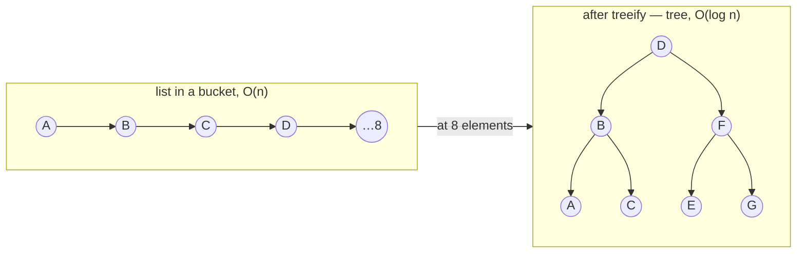

# How HashMap Works Internally

> A breakdown for people who use `HashMap` every day but don't know what's under the hood. After this you'll be able to answer any question about buckets, collisions, treeify, and resize — and that's half of a Java Core interview.

Before reading, it helps to understand `equals`/`hashCode` → equals-and-hashCode.

---

## Why HashMap exists at all

`HashMap` stores key→value pairs and can find a value by its key **almost instantly — in O(1)**.

Compare it to a list: to find an element in a list of a million, you have to walk through all of them — O(n). HashMap doesn't do that. This whole article is about exactly how it achieves O(1), and where that O(1) breaks down.

---

## Buckets

Inside a HashMap there's an array of **buckets**. By default there are **16** of them.

When you put a pair with `put(key, value)`, the map has to decide which bucket to place it in. It decides based on the key's `hashCode`:

```
bucket index = hashCode(key) % number_of_buckets
```

(in reality it's a bitwise operation, but the idea is "spread the hashCode across the number of buckets".)

When you look up `get(key)`:

1. It computes `hashCode(key)` → it immediately knows the bucket. **Instant.**
2. Inside the bucket it compares using `equals`. **Almost instant.**

That's where O(1) comes from.

```
   key "apple"                array of buckets (16 of them)
        │                     ┌──────┐
 hashCode = 93029210          │  0   │
        │                     │  1   │
 93029210 % 16 = 10  ───────► │  10  │──► ["apple" → 5]
                              │ ...  │
                              │  15  │
                              └──────┘
```

---

## Collision

There are 16 buckets, but you can put in thousands of keys. Sooner or later two **different** keys will map to the **same** bucket. That's a **collision** — and it's inevitable.

What does HashMap do? It doesn't throw away the old key. It puts both into the same bucket — as a **list**:

```
key "cat"  ─ hashCode → bucket 5 ┐
key "dog"  ─ hashCode → bucket 5 ┤
key "fox"  ─ hashCode → bucket 5 ┘
                                  ▼
   Bucket 5:  [cat] → [dog] → [fox]
```

Now on `get(key B)` the map finds bucket 5 and walks the list, comparing each with `equals`: "is it you? you?" — until it finds the right one.

---

## The long-list problem → treeify

If a single bucket holds a list of 1000 elements, searching it is **O(n)** again. The whole point of HashMap is lost.

The fix: when the list in a bucket grows to **8 elements**, Java turns it into a **balanced tree** (red-black). This is called **treeify**.

In a tree, search is **O(log n)** instead of O(n):

- list of 1000 → up to 1000 steps
- tree of 1000 → ~10 steps



**Why 8 specifically, and not right away?** A tree is "more expensive" than a list — a node takes more memory and requires balancing. For a small bucket (1–3 elements) a list is searched instantly on its own; a tree there just wastes memory. `8` is the point where the O(log n) gain starts to outweigh the overhead.

Important: with a **normal** hashCode, collisions of 8+ almost never happen. treeify is a **safety net** against a bad hashCode, not a normal mode of operation.

---

## When the map grows: load factor

As you add elements, buckets fill up, lists grow, and there are more collisions. At some point HashMap decides to **add buckets**.

This is triggered **not** by a single bucket. The map looks at the **overall ratio**:

```
total number of elements / total number of buckets
```

When it reaches **0.75** (this is the **load factor**) — the map grows, usually **doubling** the number of buckets.

By the numbers: 16 buckets × 0.75 = **12**. As soon as you put in the 12th element → resize to 32 buckets. The map doesn't wait for buckets to jam up — it reacts early, so lists don't get a chance to become long.

**Why 0.75, and not 1.0 or 0.5?** It's a compromise:

| Load factor | Memory | Speed |
|---|---|---|
| higher (→1.0) | saved | more collisions, slower |
| lower (→0.5) | wasted (empty buckets, frequent resize) | faster |
| **0.75** | **the sweet spot** | |

---

## Resize and rehashing — why it's expensive

When the map doubles (16 → 32), a subtle thing happens.

An element's `hashCode` **doesn't change** — it's fixed forever. But **the bucket is not the hashCode**, it's `hashCode % number_of_buckets`. The number of buckets changed → the bucket index changed.

Example. An element with hashCode = 20:

- with 16 buckets: 20 % 16 = **bucket 4**
- with 32 buckets: 20 % 32 = **bucket 20**

Same hashCode, different bucket. So on resize the map **must walk through all elements and redistribute them** into the new buckets. This is **rehashing**.

```
BEFORE resize (16 buckets)     AFTER resize (32 buckets)
┌──────┐                       ┌──────┐
│  4   │──► [hash=20]          │  4   │──► (empty)
│ ...  │            moved      │ ...  │
└──────┘            ════════►  │  20  │──► [hash=20]
                               └──────┘
   20 % 16 = 4                    20 % 32 = 20
```

Takeaway for the interview:

> resize is an **expensive** operation, **O(n)**: the map moves all elements. If you know up front that you'll insert ~1000 elements — create `new HashMap<>(2000)` to avoid multiple resizes.

---

## Interview cheat sheet

**"How does HashMap find an element in O(1)?"**
Key's hashCode → bucket index (instant), inside the bucket equals confirms the match.

**"What is a collision and how does HashMap handle it?"**
Two different keys in one bucket. Stored as a list; at 8 elements the list turns into a red-black tree (treeify).

**"Why treeify at 8 specifically?"**
A tree costs more memory than a list; on small buckets it doesn't pay off. 8 is the break-even point. It's a safety net against a bad hashCode.

**"What is a load factor?"**
The fill threshold (0.75). When `elements/buckets ≥ 0.75` the map doubles the number of buckets. A compromise between memory and speed.

**"What happens on resize?"**
The number of buckets doubles, and all elements are redistributed (rehashing), because bucket = hashCode % number_of_buckets. It's an O(n) operation, expensive.

**"How to avoid frequent resizes?"**
Set the initial capacity at creation, if the volume is known up front.

**"HashMap.get(null) vs Map.of().get(null)?"** *(caught by tests in iz-merch, 2026-06-12)*
`HashMap` allows a null key → `get(null)` calmly returns null. Immutable maps (`Map.of()`, `Map.copyOf()`) forbid null keys **even on reads** → `get(null)` throws NPE. Real-world example: a slot with no image → `imageUrls.get(null)` crashed 13 tests.

---

## How hashCode actually becomes an index (deeper — for the interview)

Above was simplified: "bucket = `hashCode % number_of_buckets`". In fact `HashMap` **doesn't use** `%` — it pulls two tricks, and interviewers love to ask about them.

**1. Power of two + bitmask instead of `%`.** The number of buckets is always a power of two, in which case `hash & (n - 1)` = the same as `hash % n`, but without division (a single instruction). `n-1` for 16 is `0b1111` — a mask over the low bits. As a bonus the top (sign) bit is zeroed → the index is always non-negative.

**2. Spread — mixing in the high bits:**
```java
h = key.hashCode();
h = h ^ (h >>> 16);   // the high 16 bits are XORed into the low ones
```
With `& (n-1)` the bucket is chosen only by the **low** bits. If keys share their low bits but differ in the high ones, there would be a pile of collisions. Spread smears the entropy of the upper half into the lower half. `>>>` is an unsigned shift (zeros from the left).

**The `Math.abs(Integer.MIN_VALUE)` trap** — if the index were computed as `Math.abs(hash) % n`: `Math.abs(Integer.MIN_VALUE)` returns a **negative** number (`MIN_VALUE` itself) due to two's-complement overflow → a negative index → `ArrayIndexOutOfBoundsException`. Safe options — `hash & 0x7fffffff` (zero the sign bit) or the power-of-two `& (n-1)`. A frequent trick question.

---

## TL;DR

1. HashMap = array of buckets (16 by default); bucket = `(n-1) & spread(hashCode)`.
2. Collision → elements in a bucket are stored as a list.
3. List of 8 → tree (treeify), O(n) → O(log n).
4. At 0.75 fill (load factor) → the map doubles.
5. Resize redistributes all elements (rehashing) — O(n), expensive. Know the volume → set the capacity.

## Related topics
- equals-and-hashCode — the foundation: how the bucket is computed and why equals is needed
- Collections internals
